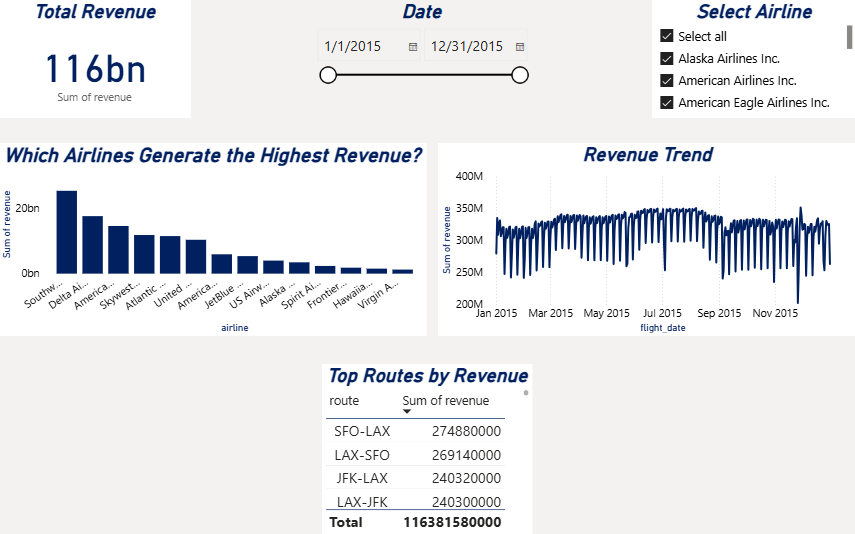
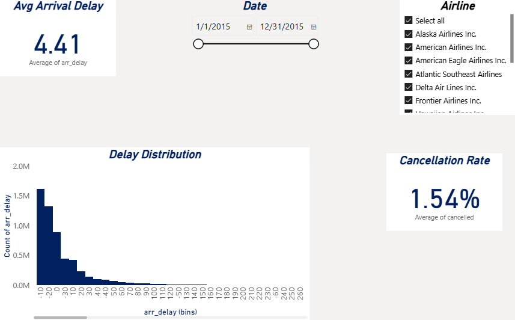
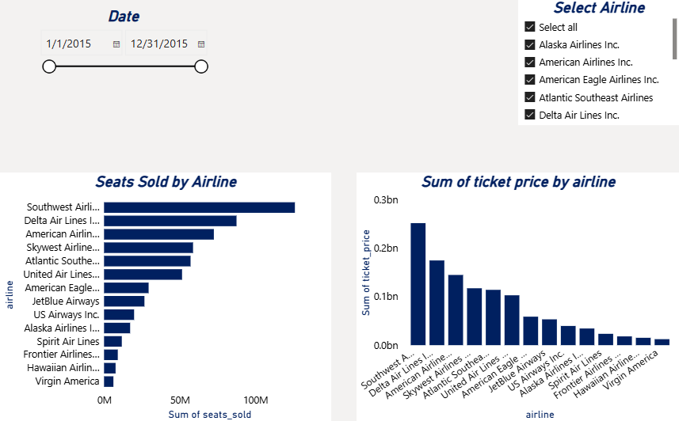

# Airline Analytics Platform

[](https://www.python.org/)
[](https://streamlit.io/)

**End-to-End Airline Analytics Platform** with **Flight Delay Prediction, Cancellation Insights, Sales Forecasting, and Power BI Dashboards** built using Python, Streamlit, SQL, and Machine Learning.

---

## 🚀 Project Overview

This platform provides a **complete airline analytics solution** for:

- Tracking flights in real-time  
- Predicting delays and cancellations using **Machine Learning**  
- Analyzing sales and revenue trends  
- Visualizing airline operations through **Power BI dashboards**

Designed for **airline operations teams, analysts, and management** to make **data-driven decisions**.

---

## 📌 Features

- **Flight Tracker:** Track flights live with origin, destination, and flight status  
- **Delay Analyzer:** Analyze historical delays and patterns  
- **Delay Prediction:** ML model predicts flight delays  
- **Cancellation Prediction:** Predict likelihood of cancellations  
- **Sales Insights:** Analyze ticket sales, revenue trends, and class-wise distribution  
- **Revenue Forecasting:** Forecast airline revenue with historical sales data  
- **Airport & Weather Analysis:** Assess weather impacts on flight delays  
- **Airline Comparison:** Compare airlines across delay metrics and sales performance  
- **Power BI Dashboards:** Interactive visualization of revenue, operations, and KPIs  

---

## 📂 Project Structure
```
airline_analytics_platform/
├─ app.py # Streamlit main app
├─ app_pages/ # Modular Streamlit pages
├─ assets/ # Images and icons
├─ dashboard/ # Power BI dashboards and PDFs
├─ data/ # Sample flight & sales data
├─ models/ # ML models and training scripts
├─ scripts/ # ETL, preprocessing, training scripts
├─ sql/ # Database schema and ER diagrams
├─ utils/ # Helper functions for DB, API, ML
├─ test_api.py # API testing scripts
├─ test_sql_upload.py # Database testing scripts
├─ requirements.txt # Python dependencies
├─ README.md # This file
└─ .gitignore # Files to ignore
```

---

## 🛠️ Tech Stack

| Layer              | Technology/Tool |
|-------------------|----------------|
| Frontend           | Streamlit       |
| Backend            | Python          |
| ML Models          | Scikit-learn, XGBoost |
| Data Processing    | Pandas, Numpy  |
| Database           | MySQL / SQLite |
| Visualizations     | Matplotlib, Seaborn, Power BI |
| Deployment         | Local / Cloud (Streamlit / Render) |

---

## 📝 How to Run Locally

1. **Clone the repo**
   
```bash
git clone https://github.com/KajolVinodGupta/Airline-Analytics-Platform.git
cd Airline-Analytics-Platform

Absolutely! Here's a **ready-to-copy version** of your README.md that you can directly paste into GitHub. I’ve included **placeholders for screenshots** so you can replace them with your actual images. I also formatted it cleanly for GitHub with Markdown badges and headings.
```

2. **Clone the repo**   

```bash
python -m venv venv
venv\Scripts\activate   # Windows
source venv/bin/activate  # Linux/Mac
```

3. **Install dependencies**

```bash
pip install -r requirements.txt
```

4. **Run Streamlit app**

```bash
streamlit run app.py
```

---

## 📊 Screenshots

**Flight Tracker Page**


**Delay Analyzer Page**


**Revenue Page**


---

**Revenue Dashboard**


---

**Operations Dashboard**



---

**Airline Comparison Dashboard**



---

**Airline_Analytics_Dashboard_PowerBI Report**

[Download Power BI Report (PDF)](dashboard/Airline_Analytics_Dashboard_PowerBI.pdf)
